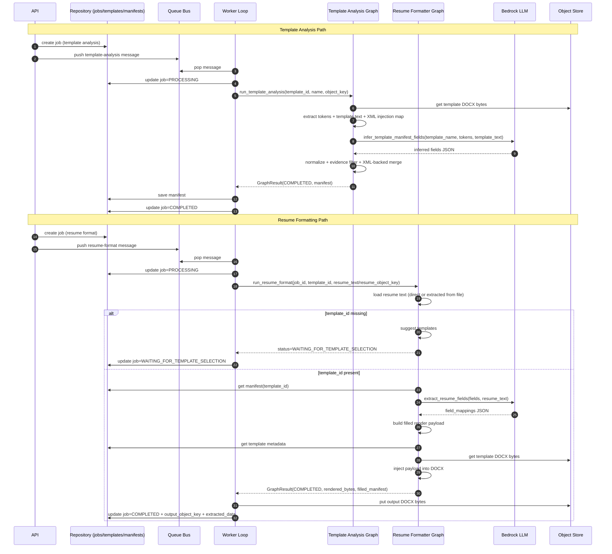

# Resume Parsing & Formatting Flow (Current)

This document describes the **current runtime flow** for both:
1) template analysis (manifest generation), and
2) resume parsing/formatting (extract + inject into DOCX).

---

## 1) End-to-end sequence

---

## 2) Template-analysis graph flow

Main code path: `src/worker/agents/template_analysis/graph.py`.

1. Load template bytes from object storage.
2. Extract candidate tokens from DOCX XML/text (`MERGEFIELD`, `MACROBUTTON`, bracket placeholders, handlebars, etc.).
3. Build `injection_details` map from XML for deterministic render anchors.
4. Run XML parser (`xml_parser.extract_fields_from_docx`) for structural signals.
5. Call LLM to infer manifest fields.
6. Normalize inferred fields, attach contracts and injection details.
7. Evidence filter removes unsupported inferred fields.
8. Deterministic merge appends missing XML-backed fields that still have evidence.
9. Return manifest payload (`manifest_schema: template_manifest_v2`).

---

## 3) Resume-format graph flow

Main code path: `src/worker/agents/resume_formatter/graph.py`.

1. Load resume input (`resume_text` or extract from `resume_object_key`).
2. If `template_id` missing, suggest templates and pause with `WAITING_FOR_TEMPLATE_SELECTION`.
3. Load template manifest for selected template.
4. Call LLM to map resume text to manifest fields.
5. Build deterministic render payload (`build_filled_template_payload`).
6. Inject payload into DOCX template (`inject_render_payload_into_docx`).
7. Return rendered bytes + filled manifest metadata.

---

## 4) What we send to LLM

### A) Template analysis LLM call (2-step plan pattern)

From `LLMClient.infer_template_fields`:

- **Step 1: layout planner**
  - `template_name`
  - `tokens_json`: JSON array of `{name, template_token}`
  - `template_text_preview`: first 6000 chars of extracted template text
  - prompt templates:
    - `template_analysis/layout_planner_system.j2`
    - `template_analysis/layout_planner_user.j2`

- **Step 2: strict manifest generation**
  - `template_name`
  - `layout_plan` (Step-1 output)
  - `tokens_json`
  - `template_text_preview`
  - prompt templates:
    - `template_analysis/template_analysis_system.j2`
    - `template_analysis/template_analysis_user.j2`

Expected response shape: JSON with top-level `fields` list.

### B) Resume extraction LLM call

From `LLMClient.extract_resume_fields`:

- `fields_json`: full manifest fields array (includes contracts and hints)
- `resume_text`: full extracted/plain resume text
- namespace: `resume_extraction`
- expected response:
  - preferred: `{"field_mappings": { ... }}`
  - fallback supported: `{"extracted": { ... }}` (adapter converts to `field_mappings`)

---

## 5) Runtime status transitions

- Template analysis job: `QUEUED -> PROCESSING -> COMPLETED|FAILED`
- Resume formatting job:
  - `QUEUED -> PROCESSING -> WAITING_FOR_TEMPLATE_SELECTION` (if no template selected), or
  - `QUEUED -> PROCESSING -> COMPLETED|FAILED`

---

## 6) Notes on non-hardcoded capture behavior

The current pipeline avoids template-specific hardcoding by combining:
- generic token scanning,
- XML-based structural extraction,
- LLM semantic grouping,
- post-LLM evidence filtering,
- deterministic XML-backed field merge.

This keeps capture flexible for new templates while still preserving placeholders that are clearly present in source DOCX markup.
