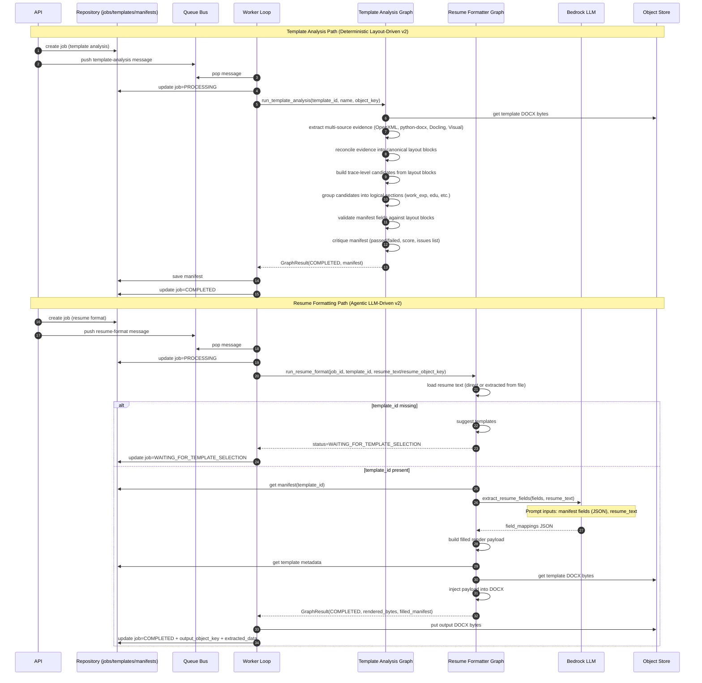

# Resume Parsing & Formatting Flow (Current)

This document describes the **current runtime flow** for both:
1) template analysis (manifest generation), and
2) resume parsing/formatting (extract + inject into DOCX).

---

## 1) End-to-end sequence

---

## 2) Template-analysis graph flow

Main code path: `src/worker/agents/template_analysis/graph.py`.

1. **Load Template Bytes:** Retrieves raw template bytes from S3 Object Store.
2. **Extract Evidence:** Performs multi-source layout extraction:
   - **OpenXML Extraction:** Scans raw DOCX XML structure to extract precise `MERGEFIELD`, `MACROBUTTON`, and structural table properties (`extract_openxml_evidence`).
   - **python-docx Extraction:** Extracts text layout, list items, and paragraph properties (`extract_python_docx_evidence`).
   - **Docling Extraction:** Identifies flow layout blocks, logical document tables, and headings (`extract_docling_layout_evidence`).
   - **Visual Extraction:** Employs bounding-box and optical layout alignment signals (`extract_visual_layout_evidence`).
3. **Reconcile Evidence:** Aggregates and reconciles the extracted multi-source layout evidence into canonical document layout blocks (`reconcile_template_evidence`).
4. **Build Candidates:** Builds trace-level field candidates from the layout blocks (slugging labels, inferring strategies and types block-by-block) (`build_field_candidates_from_evidence`).
5. **Group Logical Fields:** Groups candidates deterministically into logical structures such as `work_experience`, `education`, `key_skills`, and other metadata based on recurring placeholder anchors and section headings (`group_logical_fields_from_candidates`).
6. **Validate Fields:** Validates fields and occurrence keys against visual/OpenXML layout blocks to prevent token mismatches (`validate_manifest_fields_against_layout`).
7. **Critique Manifest:** Evaluates the manifest fields against layout rules, detecting duplicates or ungrouped blocks, and outputs a final quality score (`critique_manifest`).
8. **Save Manifest:** Saves the generated manifest (`version: 2`, `manifest_schema: template_manifest_v2`) to the database repository.

---

## 3) Resume-format graph flow

Main code path: `src/worker/agents/resume_formatter/graph.py`.

1. Load resume input (`resume_text` or extract from `resume_object_key`).
2. If `template_id` missing, suggest templates and pause with `WAITING_FOR_TEMPLATE_SELECTION`.
3. Load template manifest for selected template.
4. **Call LLM:** Maps unstructured resume text directly to template manifest fields using Bedrock LLM (`LLMClient.extract_resume_fields`).
5. Build deterministic render payload (`build_filled_template_payload`).
6. Inject payload into DOCX template (`inject_render_payload_into_docx`).
7. Return rendered bytes + filled manifest metadata.

---

## 4) Where we use LLM & Prompt Inputs

The system utilizes Bedrock LLM across three interfaces (one core production flow, and two layout planning / standardizing interfaces):

### A) Resume Field Extraction (Core Production Flow)

Used in the **Resume Formatting** path to map raw candidate resumes to the template's target schema.

* **Method:** `LLMClient.extract_resume_fields`
* **Prompt Inputs:**
  - `fields_json`: A JSON array representing the template's schema manifest fields (with names, types, expected values, display labels, formatting/source hints, and render contracts).
  - `resume_text`: The full unstructured plain text of the candidate's CV/resume.
* **Prompt Templates:** Located in `src/worker/agents/resume_extraction/prompts/` (e.g. system/user instructions for mapping).
* **Expected Response Shape:**
  - Direct JSON mapping containing either `{"field_mappings": { "<field_name>": { "value": <extracted_value>, "confidence": <float>, "status": "mapped" } } }` or a fallback `{"extracted": { "<field_name>": <value> }}` structure which is normalized programmatically.

### B) Dynamic Manifest Standardization (Agentic / CLI Path)

Used as an optional planner to standardise candidates and logical grouping dynamically from evidence when desired.

* **Method:** `LLMClient.plan_manifest_from_evidence`
* **Prompt Inputs:**
  - `template_name`: The filename of the target resume template.
  - `candidates_json`: A structured JSON string representing parsed layout blocks and candidate fields (suggested name, display label, field type, template token, source block IDs, and evidence).
* **Prompt Templates:**
  - `src/worker/agents/template_analysis/prompts/plan_manifest_system.j2` (defines general mapping rules for presenter fields, CV comments, key skills, and repeat sections without any hardcoding).
  - `src/worker/agents/template_analysis/prompts/plan_manifest_user.j2` (formats the template context and candidates for processing).
* **Expected Response Shape:**
  - A strict JSON payload with a top-level `fields` list matching the standardized names and types.

### C) Layout Reconstruct & Manifest Generation (Legacy / Alternative Pipeline)

An alternative/CLI pipeline pattern to plan document layout structure and generate templates.

* **Method:** `LLMClient.infer_template_fields` (2-step agentic call pattern)
* **Step 1: Layout Planner:**
  - **Inputs:** `template_name`, `tokens_json` (detected merge fields/placeholders), `template_text_preview` (first 6000 characters of template text).
  - **Templates:** `layout_planner_system.j2`, `layout_planner_user.j2`.
  - **Output:** A structured Markdown document outline/layout plan.
* **Step 2: Manifest Generation:**
  - **Inputs:** `template_name`, `layout_plan` (from Step 1), `tokens_json`, `template_text_preview`.
  - **Templates:** `template_analysis_system.j2`, `template_analysis_user.j2`.
  - **Output:** Strict JSON containing the inferred template schema fields.

---

## 5) Runtime status transitions

- Template analysis job: `QUEUED -> PROCESSING -> COMPLETED|FAILED`
- Resume formatting job:
  - `QUEUED -> PROCESSING -> WAITING_FOR_TEMPLATE_SELECTION` (if no template selected), or
  - `QUEUED -> PROCESSING -> COMPLETED|FAILED`

---

## 6) Notes on non-hardcoded capture behavior

The current template analysis pipeline is completely free of template-specific hardcoding. It combines:
1. **Generic multi-source token scanning** (XML/OpenXML, python-docx, Docling, visual).
2. **Reconciliation** of redundant or adjacent tokens into canonical, atomic layout blocks.
3. **Trace-level candidate construction** that links blocks dynamically to database properties.
4. **Deterministic logical grouping** (`group_logical_fields_from_candidates`) that dynamically identifies repeat blocks (like work experience and education) and arrays (like key skills) from layout cues.
5. **Structural validation and critiques** that enforce robust constraints across the manifest before saving.

This architecture ensures high capture accuracy for new custom formats and templates without requiring any hardcoded lists or rules in the production codebase.
